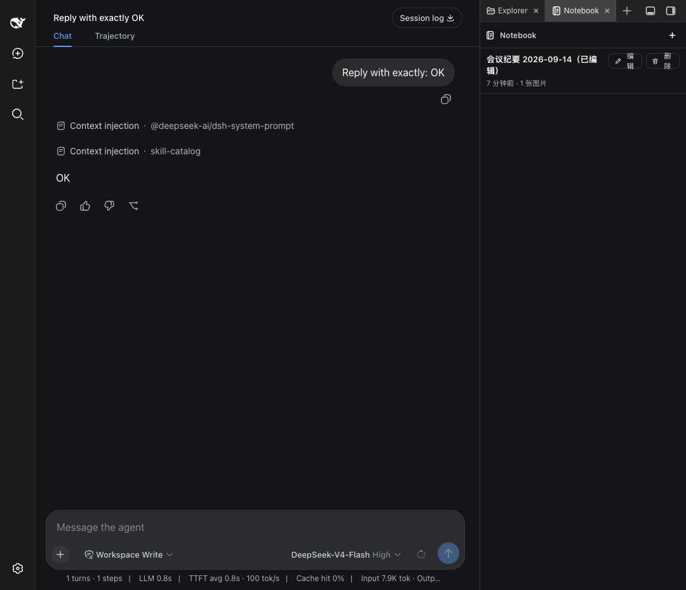

<div align="center">

# dsh-notebook

**DSH 侧边栏记事本** —— `＋` 新建 → 写标题与正文 → 贴图（拒视频）→ 「完成」以标题陈列 → 点标题复制正文 → `@` 里能引用记事 → 「编辑」复用同一个容器。

[](https://github.com/wyzh0117/dsh-notebook/actions/workflows/ci.yml)
[](./LICENSE)
[](https://nodejs.org)
[](#兼容性)
[](./test)

`dsh-plugin` · `deepseek-harness` · `notebook` · `notes` · `sidebar`

</div>

> **GitHub topics（仓库设置里加）：** `dsh-plugin` `deepseek-harness` `notebook` `notes` `sidebar`

---

## 这是什么

`dsh-notebook` 是 [DSH（DeepSeek Harness）](https://github.com/deepseek-ai/dsh) 的 Web 插件：在侧边栏里放一个**记事本**。
它不引入富文本编辑器、不做云同步、不做版本历史——只解决一件事：随手记一条带标题、正文和图片的短笔记，
需要时点一下标题就把正文送进剪贴板；也可以让输入框用 `@` 引用某条记事。

笔记是**全局共享**的（不按会话隔离），图片以**文件形式落在宿主磁盘**上并由引用路径寻址。

## 功能

| 功能 | 说明 |
|---|---|
| **`＋` 新建条目** | 侧边栏页面内右上角的 `＋`，点击后在**面板内**弹出编辑容器（不新开窗口、不新开第二个 tab） |
| **文本框容器** | 单行标题 `<input>` + 正文 `<textarea>` + 图片缩略图区，共用一个可滚动容器 |
| **可放图片，不可放视频** | 三种入口全部走同一条校验：粘贴（`onPaste`）、拖放（`onDrop`）、「插入图片」按钮（`<input type="file" accept="image/*" multiple>`）。`video/*` MIME 或 `mp4/mov/webm/mkv/avi/m4v/ogv` 等扩展名一律拒收并给出行内提示「不支持视频文件」；非图片则提示「只支持图片文件」 |
| **标题 + 正文** | 标题用于陈列，正文是载体内容 |
| **「完成」后以标题陈列** | 容器关闭，列表里一条条以**标题**为单位显示（倒序，最新在上），次要信息是「时间 · N 张图片」 |
| **点标题复制正文** | 复制的是**正文本身**（**不含标题**）；图片标记会还原成 `[图片: <文件名>]` 一行。成功后 2s toast「已复制正文（N 字）」。**点标题只复制，永远不写输入框** |
| **`@` 引用记事** | 输入框里打 `@`，在文件、会话之外多出「记事本」分组（标题 + 正文摘要，大小写不敏感匹配标题与正文，最新在前，最多 8 条）；选中插入与 `@session` 同级的**原子引用 chip**，其剪贴板/持久化形式是 `@[标题](dsh-notebook:<noteId>)` |
| **行内「对话引用」按钮** | 列表每行在「编辑 / 删除」旁多一个「对话引用」按钮，作用同 `@` 选中：插入同一个原子 chip（chip 路径不可用时退化为插入正文文本）；够不到输入框时 toast「当前没有可用的输入框」 |
| **新会话自动打开（默认关闭）** | 打开「新会话自动打开记事本」后，每进入一个新会话（新建或切换）自动打开 Notebook：原生右侧栏 / better-sidebar 用品各自的 `openTab`，独立模式展开自绘面板；插件激活时已经是的那个会话不算「新」，页面加载不会弹面板 |
| **「编辑」复用同一个容器** | 列表里点「编辑」，**同一个** `<NotebookEditor>` 实例载入该条（标题/正文/缩略图回填），DOM 中编辑器容器始终只有 1 个 |
| **图片落盘** | `dataURL` 上传，host 解码写入 `$DSH_HOME/storages/notebook-attachments/<noteId>/`，删除笔记时一并删除附件目录 |
| **原子写 + 串行化** | `notebook.json` 写临时文件 → `fsync` → 旧版备份为 `.bak` → `rename`；host 侧单进程 mutex 串行所有读改写 |
| **不静默丢数据** | `$DSH_HOME` 不可写时降级为内存态，API 响应带 `degraded: true`，客户端顶部显示非阻断提示 |
| **键盘** | `Cmd/Ctrl+Enter` = 完成，`Esc` = 取消 |

## 三层自适应行为（核心设计）

DSH 的右侧栏在 0.1.5-rc.1 前后换了主人：以前由 `dsh-better-sidebar` 这类插件自绘，之后由 DSH 内核自己拥有，
插件通过 `ctx.sidebarRightTabs` 注册 tab。所以本插件**在客户端做一次性探测**，按优先级落到三层之一，
**任何时刻页面上最多只有一个 Notebook 入口**：

| 优先级 | tier | 触发条件 | 注册方式 |
|---|---|---|---|
| 1 | **`native`** | `ctx.get('sidebarRightTabs')` 存在（DSH ≥ 0.1.5-rc.1） | 两阶段原生注册：`sidebarRightTabs.register({ id, kind, priority:'extension', title, guide })` + 把 tab 体注册进 keyed 槽 `sidebar.right.pane.tab`（key 用同一个 `id`）；另注册全局设置区 `settings.section` 与「新会话自动打开」会话监听 |
| 2 | **`service`** | `ctx.get('betterSidebar')` 存在（better-sidebar 0.4.0–0.18.x 及同类产品） | `ctx.betterSidebar.registerTab({ id:'dsh-notebook:notebook', …, single:true, settings:{ pluginToggles, render } })` |
| 3 | **`standalone`** | 二者皆无 | 自绘右侧栏（UI 完全对齐 `dsh-better-sidebar` 0.12.1），并注册**同一份**全局设置区（`settings.section`） |

几个刻意的选择：

- `export const inject = ['slots', 'locale']` —— **绝不**把 `betterSidebar` 写进 `inject`。服务不存在时插件会永不激活，tier 3 就死了。
- 探测是「同步先行 + 异步兜底」：两个 `ctx.get` 都不命中时，注册 `ctx.inject([...], cb)` 观察者，并挂一个 **700ms 兜底定时器**；定时器触发时仍无 tier 就挂载 standalone。
- **迟到升级**：若 standalone 已经挂上，之后某个服务才出现，会**先拆掉** standalone 再注册到该服务，绝不两个入口并存。
- 所有注册都包在 `ctx.effect(() => { …; return dispose })` 里，HMR / 禁用安全，二次激活不会抛 `already registered`。

### tier 3 的自绘面板（复刻 better-sidebar 0.12.1 的观感）

| 项 | 规格 |
|---|---|
| 展开按钮 | 固定在**视口右上角**的 28×28 按钮，16px 线性面板图标，约 500ms 延迟 tooltip，`aria-label` 随展开状态切换 |
| 面板几何 | `PANEL_MIN=280` / `PANEL_MAX=640` / `PANEL_DEFAULT=400`，钳制 `Math.min(max, Math.max(280, round(w)))` |
| 宽度拖拽 | 面板**左边缘** 6px 抓取条，`setPointerCapture` 后按 `clientX` 差值改宽 |
| 窄屏 | `innerWidth < 768` 时合并为全宽抽屉 `100vw`，不提供拖拽条 |
| 布局推挤 | 设置 `--dsh-notebook-width` 与 `data-dsh-notebook-collapsed` / `data-dsh-notebook-dragging`，由一份命名空间化、`dispose` 时移除的 `<style>` 消费 |
| 收起 | 面板**保持挂载**并滑出（`translateX(100%)`），过渡结束才 `visibility: hidden` |
| 持久化 | 展开状态与宽度记在 `localStorage`（键 `dsh-notebook:open` / `dsh-notebook:width`，每次访问 try/catch） |
| 减少动效 | 遵守 `@media (prefers-reduced-motion: reduce)` |

## 安装

要求：Node ≥ 20、DSH ≥ 0.1.1-rc.2、包管理器用 **pnpm**（本仓库不用 npm）。

### 方式一：从源码本地挂载（开发用）

```sh
git clone https://github.com/wyzh0117/dsh-notebook.git
cd dsh-notebook
pnpm install
pnpm build            # 产出 lib/index.js、lib/client.js、lib/types/**

# 挂进某个 DSH profile（示例用 web profile）
dsh plugin --profile web add "link:$PWD"
```

等价的纯手工做法：在 `~/.dsh/profiles/web/package.json` 里

```jsonc
{
  "dependencies": { "dsh-notebook": "link:/abs/path/to/dsh-notebook" },
  "dsh": { "profile": { "bundles": [ /* … */, "dsh-notebook" ] } }
}
```

然后在 profile 目录里 `pnpm install`。`dsh.profile.bundles` 必须包含 `dsh-notebook`，否则插件不会被加载。

### 方式二：从仓库安装

```sh
dsh plugin --profile web add github:wyzh0117/dsh-notebook
```

> 本地开发时**不要**重启你正在用的那个 DSH（比如 3080 端口的 Web GUI，重启会杀掉当前会话）。
> 需要真机验收时，另起一个隔离环境：
> ```sh
> DSH_HOME=/tmp/dshnb-home npx -y --package @deepseek-ai/dsh dsh web --port 3099
> ```

## 使用

1. 展开右侧栏，打开 **Notebook**。
2. 点右上角 **`＋`** → 面板内弹出编辑容器。
3. 写**标题**和**正文**；需要配图就**粘贴 / 拖入图片**，或点「插入图片」。
   - 视频会被拒绝并提示「不支持视频文件」；单图上限 10 MB，单条上限 20 张（可在设置里调）。
4. 点「完成」（或 `Cmd/Ctrl+Enter`）→ 容器关闭，条目以**标题**陈列。
5. 点**标题文字** → 正文（不含标题）进剪贴板，toast 提示「已复制正文（N 字）」。
   **点标题是纯复制**：v1.1 的输入框附件桥虽然实现了，但没有任何 UI 入口（见下节）。
6. 想让模型读某条记事：在输入框里打 **`@`** 选「记事本」分组里的条目，或点该行的 **`对话引用`** ——插入的是一个原子引用 chip，
   发送时只有**正文**交给模型（标题不发）。
7. 点行尾 **`编辑`** → **同一个容器**载入该条继续编辑；点 **`删除`** 删除该条及其附件目录。
8. 想每进一个新会话就自动看到记事本：到设置里打开「新会话自动打开记事本」（默认关闭，三层 tier 都生效）。

## 与 DSH 会话联动（v1.1）

这里的接缝都只走**公开 seam**，且**全部可选**：客户端 bundle 只能 require 模块表里的包，import 不了 DSH 的 UI 包，
所以一律鸭子类型 + 逐个 `try/catch`——宿主缺 `ctx.conversation` / `ctx.inputTriggers` / `ctx.sessions` 时只是少一个能力，
退回 v1 行为，绝不报错。

用户可见的是两项：`@` 引用（§2）与「新会话自动打开」（§3）。另有一条**已实现、有单测、但没有任何 UI 入口**的输入框附件桥（§1）。

### 1. 输入框附件桥（**已实现，未接线**）

> **产品决定（2026-09-15）：** 点标题必须**只复制**，绝不自己往输入框里写东西。
> 因此这条附件路径的**唯一入口被移除**：`NotebookView` 里的标题动作是 `handleCopyBody`（纯 `buildClipboardText` + `copyText`），
> 不再调用 `attachImages`；`composer.ts` 里 `NotebookComposer` 的文档注释记着同一条 WIRING NOTE。
> 代码与单测**刻意保留**（接缝才是贵的那部分，且已有覆盖），等一个属于它自己的显式动作来接。

桥本身做了什么（对未来的调用方而言，也解释了保留它的原因）：

- `attachImages(note)`：解析目标（`ctx.sessions` 有 current 会话 + `ctx.conversation` 在 + 该会话的 input facade 可用）→
  用本插件自己的路由 `GET /notebook/api/attachments/<noteId>/<file>` 把落盘图片读回 `File` →
  `ctx.conversation.createDrafts(sessionId, files)` 生成浏览器侧草稿附件 → `input.addAttachments(ids)` 放进附件栏。
  图片只活在草稿里，**发送时才真正上传**；输入框**拒收**时 `releaseDraftAttachments` 把草稿还回去（不留 object URL / 上传残留）。
  记事里格式不支持的图片（**SVG 不行**，只收 png / jpeg / webp / gif）与读取失败的图片分别计入 `skipped` / `failed`；
  一张都插不进去时返回 `no-target` / `no-images` / `fetch-failed`。
- `appendText(text)`：把 `buildBodyText(note)`（**图片标记整段移除**，避免与附件栏重复）写进草稿；优先会话作用域的
  `slash/input-insert-text`（在 caret span 上拼接，草稿里已有的 `@` chip 不会被整篇重建掉），其次 input facade 的
  `insertText`，最后才退回 `setDraft` 整篇重写。
- 这条路径**没有 UI 入口**：`attached` / `attachedPartial` / `attachSkipped` / `attachReadFailed` / `attachedBodySkipped`
  等提示文案已随入口一并从 `locales.ts` 删除（最后一个遗留键 `attachFailed` 也已移除，最终产物里不再出现任何附件提示文案）。
- 由于标题动作是纯复制，**这条桥不影响 `@` 引用**：引用走的是另一条 seam（见下）。

### 2. `@` 引用与「对话引用」按钮

- 插件通过 `ctx.inputTriggers.registerSource` 注册名为 `dsh-notebook` 的 `@` 源（`order: 20`，内置源在 0），
  输入 `@` 时与文件、会话并列；每行是标题 + 正文摘要（图片标记去掉、空白压成一行，超 60 字截断），
  分组标题取本地化的「记事本」/“Notebook”。候选按输入内容**大小写不敏感**匹配标题与正文，**最新更新在前，最多 8 条**；
  查询被 abort 或读取失败时该源返回空列表（不打断整个菜单）。注册被拒（HMR 期上一个激活还没卸载，而 source 名就是序列化路由键、不能改名）时
  每 500ms 重试、至多 5 次再告警放弃。
- 选中一行插入**原子 inline chip**（标签是标题），其剪贴板/持久化形式是规范 mention `@[标题](dsh-notebook:<noteId>)`
  （标题里的 `[` `]` 会被剔除）。
- **发送时**触发管线按 source 名把每个 chip 交给本插件的 `codec.serialize`：返回的是**正文本身**——
  **标题绝不发给模型**——其中每个图片标记写成一行 `[图片: <文件名>]`。
- 失败策略与管线契约一致：**记事已被删除** → 序列化为空串（引用自然消失，不阻塞发送）；
  **真实读取失败** → reject，发送被拦下并给出可见错误，而不是把 mention 悄悄降级成 `@标题`。
- 行内「对话引用」按钮走同一条路：经会话作用域的 `slash/input-insert-reference` 事件插入同一个 chip（该事件在 caret span 上拼接，chip 保真）；
  该路径不可用时退化为插入正文文本。够不到输入框时 toast `refUnavailable`（「当前没有可用的输入框」），不假装成功。
- 三个行内动作（对话引用 / 编辑 / 删除）现在**可换行**（`flexWrap`），窄面板里标题与按钮都还读得清。

### 3. 新会话自动打开（默认关闭）

| 项 | 行为 |
|---|---|
| 偏好 | `autoOpenOnNewSession`，**默认 `false`**，与其它偏好一样存在 host 的 `NotebookDoc.prefs` |
| 生效层 | **三层 tier 都接**（`attachSessionAutoOpen`），各用各的打开手势；某个 tier 打不开（例如 sidebar 产品没有 `openTab`）时该层静默失效，不会假装打开 |
| 触发 | 会话列表里**当前会话变成另一个**（新建，或切到别的会话）——同一个会话的快照重复发布不算 |
| 不触发 | 插件激活时**已经是**当前会话的那个（页面加载不弹面板）；`current` 变成 `null`（hero 页）也不开 |
| 重试 | 新会话的侧栏 surface 还没挂载时 `openTab` 会抛（或 `open()` 报失败），按 `0 / 200 / 500 / 1200 / 2500 ms` 重试；会话再次变化或插件卸载即放弃 |
| 手势 | tier 1：`sidebarRight.openTab('dsh-notebook')` + 收起时 `toggleExpanded()`；tier 2：`service.openTab({ type, title })`；tier 3：自绘面板的 `control.setOpen(true)` |
| 设置入口 | tier 1 与 tier 3 注册**同一份**全局设置区（`settings.section` 槽，共用 `hosts/settingsSeat.ts`，含全部 6 项偏好）；tier 2 走 `registerTab({ settings })`，声明行是 5 项（除 `openOnStart` 外的全部偏好），渲染的仍是同一份面板 |

## 架构

```
                     ┌──────────────────────── 浏览器 ────────────────────────┐
                     │ lib/client.js  (CJS 模块表工厂, id = "dsh-notebook")   │
                     │  三层探测 → native / service / standalone              │
                     │  NotebookView ─ NotebookEditor(唯一实例) ─ clipboard    │
                     │  composer 桥(引用 chip；附件/正文已实现未接线)         │
                     └───────────────────────────┬───────────────────────────┘
                                    fetch JSON   │
                     ┌───────────────────────────┴───────────────────────────┐
                     │ lib/index.js   (cordis 插件, ctx.webServer prefix)     │
                     │  routes.ts ─ store.ts (原子写 + mutex) ─ attachments.ts│
                     └───────────────────────────┬───────────────────────────┘
                                                 │
                            $DSH_HOME/storages/notebook.json
                            $DSH_HOME/storages/notebook.json.bak
                            $DSH_HOME/storages/notebook-attachments/<noteId>/<attachmentId>.<ext>
```

原生 tier 的 tab 体从槽注入的 `useTabInfo()` 钩子读可见性（DSH 0.1.5-rc.2 渲染 tab 时不传 `props.tab.visible`，
只有这个注入的钩子知道），所以**隐藏的 tab 真的不加载、不轮询**——`NotebookView` 在 `visible === false` 时一次 host 请求都不发。

### 宿主 HTTP API

注册在 `ctx.webServer`（`kind: 'prefix'`，`path: '/notebook/api'`），JSON over HTTP，
**所有**响应带 `Cache-Control: no-store`。

| 方法 | 路径 | 请求 | 响应 |
|---|---|---|---|
| `GET` | `/notebook/api/state` | — | `{ doc, degraded? }` |
| `POST` | `/notebook/api/notes` | `{ title, body, attachments: [{ name, mime, size, dataUrl }] }` | `{ note }` |
| `PATCH` | `/notebook/api/notes/:id` | `{ title?, body?, attachments? }` | `{ note }` |
| `DELETE` | `/notebook/api/notes/:id` | — | `{ ok: true }` |
| `PATCH` | `/notebook/api/prefs` | `Partial<NotebookPrefs>` | `{ prefs }` |
| `GET` | `/notebook/api/attachments/:noteId/:file` | — | 图片字节 + `Content-Type` |
| `GET` | `/notebook/api/health` | — | `{ ok, version, degraded }` |

- 图片用 **dataURL** 上传（客户端 `FileReader`），host 解码落盘——避免 multipart 解析依赖。
- **安全栅栏**：只接受来自 loopback 的请求（`req.socket.remoteAddress ∈ 127.0.0.1/::1`），
  并校验 `Origin`/`Host` 属于允许的本地来源，否则 `403`；路径参数做防穿越校验
  （`path.resolve` 后必须仍在附件根内）。单请求 body 上限 32 MB，超限 `413`。
- `400/403/404/413/415/500` 都返回结构化 `{ error: { code, message } }`。
- **host 端二次校验视频**（不信任客户端）：命中即 `415`。

### 数据落盘

| 路径 | 内容 |
|---|---|
| `$DSH_HOME/storages/notebook.json` | `NotebookDoc`（`version: 1`、`notes[]`、`prefs`），原子写 |
| `$DSH_HOME/storages/notebook.json.bak` | 上一次成功版本；JSON 损坏时先尝试用它恢复 |
| `$DSH_HOME/storages/notebook-attachments/<noteId>/<attachmentId>.<ext>` | 图片字节 |

`$DSH_HOME` 优先级：显式注入 > `process.env.DSH_HOME`（纯空白视为未设置）> `~/.dsh`。
`.bak` 也损坏时从空文档开始，并把坏文件改名为 `notebook.json.corrupt-<ts>`。

## 设置项

三层 tier **共用同一份定义**，真值存在 host 的 `NotebookDoc.prefs`（跨 tier、跨浏览器一致），
读写一律走 `PATCH /notebook/api/prefs`——tier 2 **不用** better-sidebar 自己的 `pluginSettings`，否则三层会不一致。

| 键 | 类型 | 默认 | 说明 |
|---|---|---|---|
| `sortOrder` | `'updated' \| 'created' \| 'title'` | `'updated'` | 列表排序：最近更新 / 最近创建 / 标题升序 |
| `copyImagesAsName` | boolean | `true` | 复制正文时把图片写成 `[图片: <文件名>]` 一行 |
| `maxImagesPerNote` | number | `20` | 单条笔记图片数上限（1–100） |
| `confirmDelete` | boolean | `true` | 删除前二次确认 |
| `openOnStart` | boolean | `false` | **tier 3 专用**：DSH 启动即展开侧边栏 |
| `autoOpenOnNewSession` | boolean | `false` | 每进入一个新会话就打开 Notebook 页（三层 tier 都生效；默认关闭，页面加载时不弹） |

暴露位置：tier 1 与 tier 3 注册**同一份**全局设置区（`settings.section` 槽，共用 `hosts/settingsSeat.ts`，
所以两边字段、文案完全一致）；tier 2 走 `registerTab({ settings: { pluginToggles, render } })`——
声明行现在是 5 项（除只在独立层有意义的 `openOnStart` 外的全部偏好），渲染的仍是同一份 `<NotebookSettingsPanel>`。
所有改动都经 `PATCH /notebook/api/prefs` 落到 `NotebookDoc.prefs`（host 侧对每个 key 做类型校验）。

## 与 dsh-better-sidebar 的关系

- **我们不是它的 fork，也不依赖它。** `dsh-better-sidebar` 只在 `peerDependencies` 里以
  `optional: true` 出现，源码里对它是**零 import**（只用结构化鸭子类型调用 `ctx.betterSidebar`），
  所以永远不会出现两份实例。
- **装了它（0.4.0–0.18.x）**：走 tier 2。展开它绘制的右侧栏，里面会**多出** Notebook 这一项，
  与它原有的 editor / git / terminal / browser 等并列。我们有意避开它保留的 id
  （`editor` `git` `subagent` `sidechat` `terminal` `browser` `diff`），自己的 id 是 `dsh-notebook:notebook`。
- **装了它 0.19+（右栏已交给 DSH 内核）**：走 tier 1，tab 出现在内核绘制的那一列里。
- **没装任何 sidebar 产品**：走 tier 3，本插件自带展开式右侧栏，UI 对齐 better-sidebar 0.12.1 的观感
  （按钮位置、面板宽度与拖拽、窄屏全宽、收起动画）。

## 兼容性

| | |
|---|---|
| DSH | 最低支持 `>=0.1.1-rc.2`；**开发机实测 `0.1.5-rc.2`**，并装有 `@deepseek-ai/dsh-client-ui-sidebar-right`，所以原生右侧栏存在、**tier 1 是本机实际生效层**（tier 1 需要 DSH ≥ `0.1.5-rc.1` 且装有该包） |
| Node | `>=20`（开发与构建） |
| `dsh-better-sidebar` | 可选。tier 2 面向 0.4.0–0.18.x；0.19+ 归入 tier 1 |
| DSH 侧可选插件 | `conversation`（会话输入框）、`inputTriggers`（`@` 触发管线）、`sessions`（会话列表）任一缺失时，对应的联动能力自动关闭并退回 v1 行为 |

## 已知限制（v1 / v1.1 有意不做的）

- **不支持视频 / 音频等富媒体**——这是需求明确排除项，client 与 host 双侧都拒绝。
- 不做多用户、云同步、分享、实时协同、AI 自动整理。
- **没有版本历史**，只保留最近一次内容。
- 笔记**全局共享**，不按会话隔离。
- 正文是**纯文本 + Markdown 图片标记**（``），不是富文本；不引入富文本编辑器依赖。
- tier 1 的注册序列由 `test/tier-detect.test.ts` 用假 ctx 覆盖，并按 0.1.5-rc.2 的**真实类型声明**核对过（见 `src/client/hosts/native.ts` 文件头）；本机已装 `dsh-client-ui-sidebar-right`、tier 1 实际生效，但 v1.1 的三个功能**没有人工点过 GUI**（只有单元 / 组件测试 + 线上接口验证，见〈验证状态〉）。
- **SVG 走不了输入框附件桥**：附件桥只接受 png/jpeg/webp/gif（记事本身仍支持 SVG，只是这条桥不收）；该桥目前没有 UI 入口，见〈与 DSH 会话联动〉。
- **引用只送正文，不送标题**：`@[标题](…)` 里的标题是给人看的标签，序列化时被有意丢弃；图片写成一行 `[图片: <文件名>]`。
- **未发送的 `@` 引用在页面刷新后会退化成字面 mention**：DSH 把未发送的草稿按**剪贴板投影**存进 `localStorage`（`dsh.conversation`，按会话），
  而本插件没有 host 半侧的 mention 解析器——`dsh-session:` 那类 mention 由 `@deepseek-ai/dsh-session-reference` 在 `agent/pre-step` 展开，
  我们没接这条 seam——所以刷新后模型收到的是字面文本 `@[标题](dsh-notebook:<noteId>)`，而不是记事正文。
  规避：发送前别刷新，或刷新后重新插入引用。host 半侧接同一条 `agent/pre-step` seam 做展开是已确定的修法，v1.1 有意不做。
- **「新会话自动打开」在没有打开手势的载体上失效**：三层 tier 都接同一个监听，但 sidebar 产品若不提供 `openTab`，该层就静默不打开（不假装成功）。
- 对话联动能力**随宿主而变**：宿主没有 conversation / input-trigger / sessions 服务时，退回 v1 行为（复制正文、不渲染引用按钮）。
- 不修改 DSH 源码（硬约束）。

## 开发

```sh
pnpm install        # 只用 pnpm，npm 在本仓库不受支持
pnpm typecheck      # tsc --noEmit
pnpm test           # vitest run（host 用 node 环境，*.test.tsx 用 jsdom）
pnpm build          # tsc -p tsconfig.build.json && tsdown → lib/index.js + lib/client.js + lib/types/**
pnpm watch          # tsdown --watch
```

仓库根的 `pnpm-workspace.yaml` 只有一条配置 `autoInstallPeers: false`。原因：`dsh-better-sidebar` 是
*optional* peer，pnpm 会去解析它并选中 0.19.x，而 0.19.x 的 `@deepseek-ai/*` peer 范围（`^0.1.5`）
在 npm 上只有预发布版（`0.1.5-rc.2`）可匹配——semver 不允许非预发布范围匹配预发布版本，安装会以
`ERR_PNPM_NO_MATCHING_VERSION` 失败。本仓库真正需要构建的 peer 全部是显式 `devDependencies`，关掉
peer 自动安装不影响任何东西。详见 [`docs/specs/scaffold-notes.md`](docs/specs/scaffold-notes.md)。

客户端产物不是普通 ESM，而是注册到全局模块加载器的 CJS 闭包工厂：

```js
window.__ModuleLoader__.load({ id: "dsh-notebook", factory: (require) => {
  var module = { exports: {} }; var exports = module.exports;
  /* …打包后的 CJS 代码… */
  exports.apply = apply; exports.inject = inject;
  return module.exports;
} });
```

因此 `src/client/**` 里**禁止** `node:*` 导入，**禁止**除模块表外部项
（`react`、`react/jsx-runtime`、`react-dom`、`react-dom/client`、
`@deepseek-ai/dsh-client-ui-slots`、`@deepseek-ai/dsh-client-ui-primitives`）
之外的 `@deepseek-ai/*` **值导入**；
`codeSplitting: false` 也是必须的（工厂里的 `require` 无法解析相对 chunk URL）。

## 截图

> 以下均为**真机实测截图**（截图时的 DSH 为 `0.1.1-rc.2`，tier 3 自绘面板）。

**tier 2 — 装了 `dsh-better-sidebar` 时融入其中**：展开它自己的右侧栏，「New tab」里在原有内容
（Explorer / Source Control / Tasks / Terminal / Browser）之外多出一行 **Notebook**，点开就是本插件：



**tier 3 — 没装任何 sidebar 产品时自带侧边栏**：

| | |
|---|---|
|  |  |
| 侧边栏里的 Notebook 列表（`＋` 在右上角），展开时把会话列推挤 400px | 编辑容器：标题 + 正文 + 图片缩略图（粘贴/拖入/按钮三种入口） |
|  |  |
| 点标题后 toast「已复制正文（67 字）」——复制的是正文，不含标题 | 未装 sidebar 产品时的自绘面板：开合按钮固定在视口右上角 |

## 验证状态

在**隔离环境**（`DSH_HOME=/tmp/dshnb-home`，不碰用户正在用的实例）里真机跑过（tier 3 / tier 2 那几行是 `0.1.1-rc.2` 时代的记录；
最后两行是**当前运行中的 3080 实例**，DSH `0.1.5-rc.2`）：

| 项 | 方式 | 结果 |
|---|---|---|
| `tsc --noEmit` | 全仓 | 0 错误 |
| 单元 / 组件测试 | `vitest run` | **164 passed (12 files)** |
| 构建 | `tsc -p tsconfig.build.json && tsdown` | `lib/index.js`（ESM 54 KB / 54410 B）+ `lib/client.js`（CJS 148 KB / 148508 B）+ `lib/client.js.map` |
| 客户端 bundle 形态 | CI 里用 stub `require` **实际执行** `lib/client.js` | `id=dsh-notebook`、`exports=apply,inject,…`、`inject===['slots','locale']`、零 `node:` require |
| **tier 3**（无 sidebar 产品） | 真浏览器实测 | 开合按钮钉在视口右上角（`top:10,right:innerWidth-10`，28×28）；展开后 `--dsh-notebook-width: 400px` 且 `#root` 的 `margin-right` 变 400px（把会话列推挤）；左边缘 6px 拖拽条；收起时 `translateX(102%)` + `visibility:hidden` 且推挤归零 |
| **tier 3 的 G3–G8** | 真浏览器逐条实测 | `＋` → 编辑器容器恰好 **1 个**；写入标题正文；贴入 png 成功、贴入 mp4 报「不支持视频文件」；「完成」后容器关闭、条目以标题陈列；点标题 → 剪贴板拿到**正文（不含标题）**且图片变 `[图片: nb-test-image.png]`，toast「已复制正文（67 字）」；点「编辑」→ 仍是 **1 个**容器且标题/正文/缩略图全部回填，改完再存列表更新 |
| **tier 2**（装 `dsh-better-sidebar@0.12.1`） | 真浏览器实测 | 自绘面板**完全不挂载**（探测正确落到 service 层）；better-sidebar 的「New tab」里在 Explorer / Source Control / Tasks / Terminal / Browser 之外多出 **Notebook**；点开即在它的面板里渲染本插件，并读到同一份全局笔记 |
| 持久化 | 重启 + 换安装通道后复测 | `notebook.json`、`.bak`、`notebook-attachments/<noteId>/<附件>.png` 落盘正确；换成 release tarball 安装后数据仍在，附件路由返回 `200 image/png` |
| 发布产物 | 用 release tarball 装进干净 profile | `dsh plugin` 挂载成功，host 路由与客户端 bundle 均正常 |
| CI | GitHub Actions | 绿 |
| **v1.1 产物已上线**（运行中的 3080 实例） | `GET /plugins/??dsh-notebook/client.js&rev=<framed hash>` | **200**；返回字节含 `slash/input-insert-reference`、`slash/input-insert-text`、`autoOpenOnNewSession`、`noteReferenceInsert`、`useTabInfo`（以及被保留但未接线的桥所用的 `createDrafts` / `attachImages` 符号）——即 v1.1 的代码确实在被服务的产物里；已下线的附件提示文案（`attachSkipped` / `attachReadFailed`）**不再出现**。rev = `sha1("plugin-artifact" ‖ \0 ‖ len:lib/client.js ‖ len:lib/client.js.map)` 前 12 位十六进制，**每次重新构建都会变**，核对时按当前 `lib/` 现算（写下这份文档时构建得到 `f2b51cf68d61`） |
| **v1.1 host 路由在线** | `GET /notebook/api/state`、`GET /notebook/api/attachments/<noteId>/<file>` | `state` → **200** `application/json` 返回真实文档；附件 → **200 `image/png`（663081 字节）**——正是附件桥每张图要走的取字节路径（该桥已实现但未接线，当前没有 UI 调用它） |

tier 1（DSH ≥ 0.1.5-rc.1 的原生右侧栏）**没有人工点过 GUI**：注册序列由 `test/tier-detect.test.ts` 用假 ctx 覆盖，
并已按 0.1.5-rc.2 的**真实类型声明**核对（`src/client/hosts/native.ts` 文件头记录了这一点）；本机装着
`dsh-client-ui-sidebar-right`、tier 1 是实际生效层。

v1.1 的用户可见功能（`@` 引用 + 「对话引用」、新会话自动打开）**没有人工点过 GUI**，行为只由单元 / 组件测试保证；
输入框附件桥没有 UI 入口，只有桥级别的单测（真机验证到的是上表最后两行：产物上线 + host 接口应答）：

| 功能 | 覆盖它的测试 | 断言到哪一步 |
|---|---|---|
| 输入框附件桥（**已实现，未接线，无 UI 入口**） | `test/composer.test.ts`（31）；`test/view-actions.test.tsx`（7）断言的是**相反**的行为 | 桥级别：目标解析（无 conversation / 无当前会话 / 无 scope 时返回 null）、落盘图片读回成 `File`、`createDrafts` + `addAttachments` 的调用序列、拒收时释放草稿、SVG 跳过、张数上限、三条文本写入路径（scoped 事件 → `insertText` → `setDraft`）、含 chip 的 detect span 换算（空 clipboardText 的 chip 也覆盖）、无目标 / 无图片时不谎报成功。UI 级别：**点标题只复制并把输入框完全放在一边**（含图片的记事也一样），没有输入框桥时同样复制 |
| `@` 引用 + 「对话引用」 | `test/reference.test.ts`（17）+ `test/view-actions.test.tsx`（7） | `registerSource` 只注册一次且可 dispose、**注册被拒时按重试预算重试并在超限后报出**、候选过滤 / 排序 / 8 条上限 / 分组、`onPick` 产出 chip 与规范 mention、**序列化只含正文不含标题**、已删除的记事序列化为空、真实读取失败向上抛、行内按钮插入引用与 `refUnavailable` 提示 |
| 新会话自动打开 | `test/auto-open.test.ts`（11）+ `test/tier-detect.test.ts`（14）+ `test/native-tab-body.test.tsx`（3） | 激活时已存在的会话不触发、同一会话的快照重复发布不重复触发、偏好为默认 `false` 时不触发、surface 未挂载时按 `0 / 200 / 500 / 1200 / 2500 ms` 重试并在会话再次变化时放弃、没有 `ctx.sessions` 时静默、**三层 tier 各接自己的打开手势**（原生 `openTab` / sidebar `openTab` / 自绘面板 `setOpen`）、原生 tab 体经槽注入的 `useTabInfo()` 读可见性（隐藏即不加载、不轮询）、`mergePrefs` 只应用出现的键 |

另有一条防漂移守卫：`test/routes.test.ts` 的「accepts EVERY preference key the plugin exposes」断言 `PATCH /notebook/api/prefs` 接受的 key 集合等于 `Object.keys(DEFAULT_PREFS)`——正是它抓出了 `/prefs` 静默丢掉 `autoOpenOnNewSession` 的真实 bug。

这些实现依赖的 DSH seam（`ctx.sessions`、`ctx.conversation.createDrafts` / `input.for(actx)`、
会话作用域的 `slash/input-insert-reference` / `slash/input-insert-text`、`ctx.inputTriggers.registerSource`）
是**读 DSH `0.1.5-rc.2` 已发布的 client 包**（类型声明与实现）对齐出来的，不是靠人工点击确认的：
开发机运行的正是 `0.1.5-rc.2`，`dsh-client-ui-conversation` / `dsh-client-ui-input-trigger` / `dsh-client-ui-sidebar-right` 都在场；
上表行为仍然**只由单元 / 组件测试保证**（真机只验证了产物被服务、host 接口应答这两点）。

## FAQ

**Q：我贴了 mp4，为什么没反应？**
A：v1 明确不支持视频。客户端与 host 双侧都会拒收，并给出行内提示「不支持视频文件」。

**Q：为什么点标题复制出来的正文里图片变成了 `[图片: 文件名]`？**
A：剪贴板里写的是纯文本。图片是磁盘上的文件，无法作为文本带走，所以还原成一行文件名占位。
可以在设置里把 `copyImagesAsName` 关掉，那样图片标记会整段略去。

**Q：点标题会把记事里的图片送进输入框吗？**
A：不会。v1.1 一度把「含图片的记事」接到输入框（图片作附件、正文进草稿），但 2026-09-15 的产品决定把点标题改回
**纯复制**，唯一的入口也随之移除。附件桥的代码与单测保留在 `composer.ts`（等一个属于它自己的显式动作接线），
但当前**没有任何 UI 能触发它**：点标题永远只把正文复制到剪贴板。

**Q：为什么刷新页面后，之前插的 `@` 引用变成了 `@[标题](dsh-notebook:xxx)`？**
A：DSH 把未发送的草稿按剪贴板投影存进 `localStorage`，而本插件没有 host 半侧的 mention 解析器
（`dsh-session:` 那类 mention 由 `@deepseek-ai/dsh-session-reference` 在 `agent/pre-step` 展开，我们没接这条 seam），
所以刷新后 chip 退化成字面文本。发送前别刷新，或刷新后重新插入引用即可。

**Q：`@` 引用发出去的是什么？**
A：只有正文。chip 上显示的是标题，但发送时序列化的是正文（每个图片标记写成一行 `[图片: <文件名>]`），
标题是给人看的标签，**不会**交给模型。被引用的记事如果已经删掉，这段引用就什么都不贡献；读取真失败时发送会被拦下并报错。

**Q：笔记存在哪里？会上传吗？**
A：全部在本机 `$DSH_HOME/storages/` 下。没有任何远端上传；HTTP API 只监听 loopback。

**Q：图片会不会丢？**
A：不会静默丢。上传失败的条目会保留为错误项并允许重试；`$DSH_HOME` 不可写时降级为内存态并在
API 响应里带 `degraded: true`，界面顶部会显示非阻断提示。

**Q：能同时装 better-sidebar 和这个插件吗？**
A：能，这正是 tier 2 的场景——Notebook 会作为一项出现在它的右侧栏里。

**Q：tier 1 在我这台机器上能跑吗？**
A：如果你装的 DSH < 0.1.5-rc.1，就没有 `ctx.sidebarRightTabs`，会自动落到 tier 2 或 tier 3。

**Q：`pnpm install` 报 `ERR_PNPM_NO_MATCHING_VERSION: @deepseek-ai/dsh-*`？**
A：那是 pnpm 在自动安装 peer。本仓库根的 `pnpm-workspace.yaml` 已设 `autoInstallPeers: false`
（pnpm 11 从 `pnpm-workspace.yaml` 读项目配置，不再从 `.npmrc` 读）；若你在别处复刻包配置，加上同样的设置即可。

## 许可

[MIT](./LICENSE) © 2026 wyzh0117
