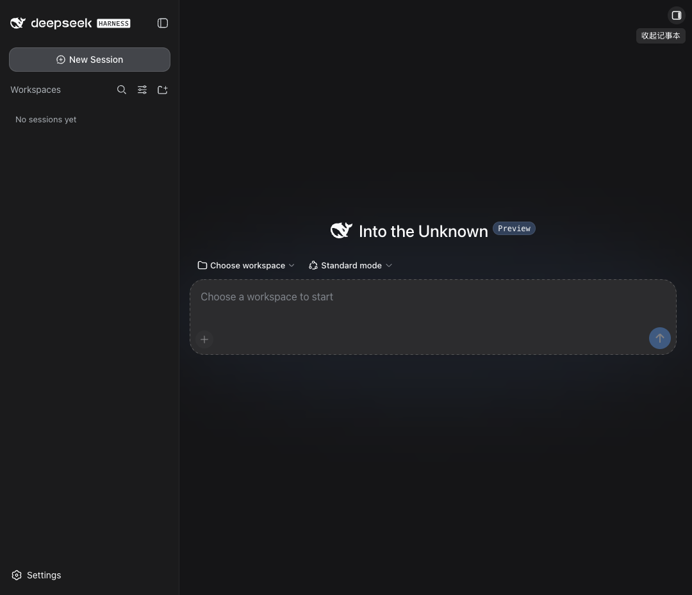
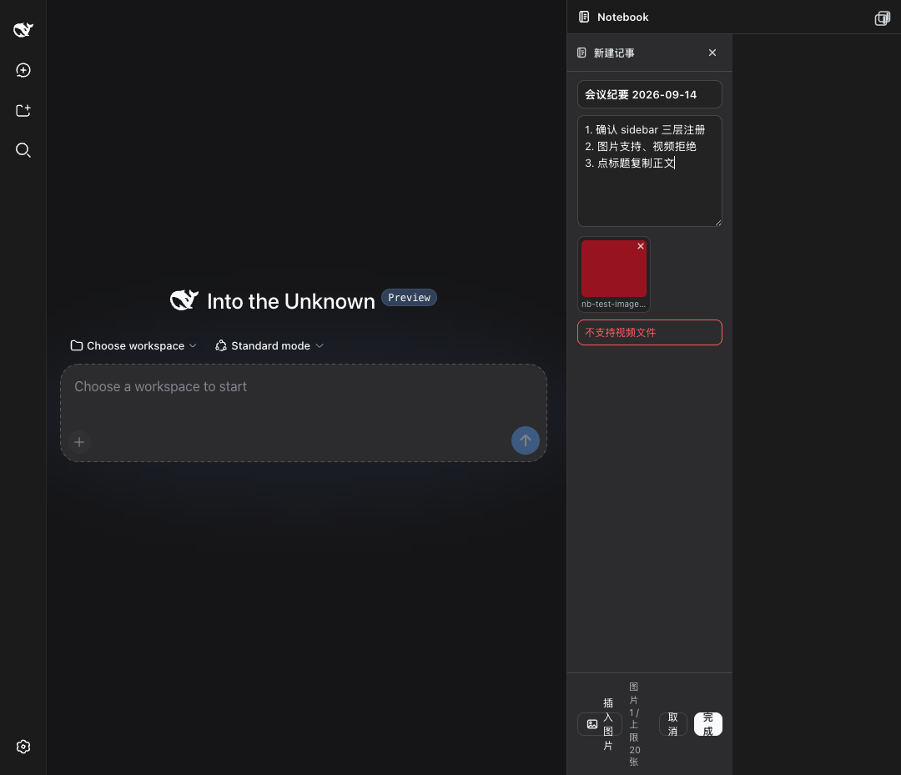
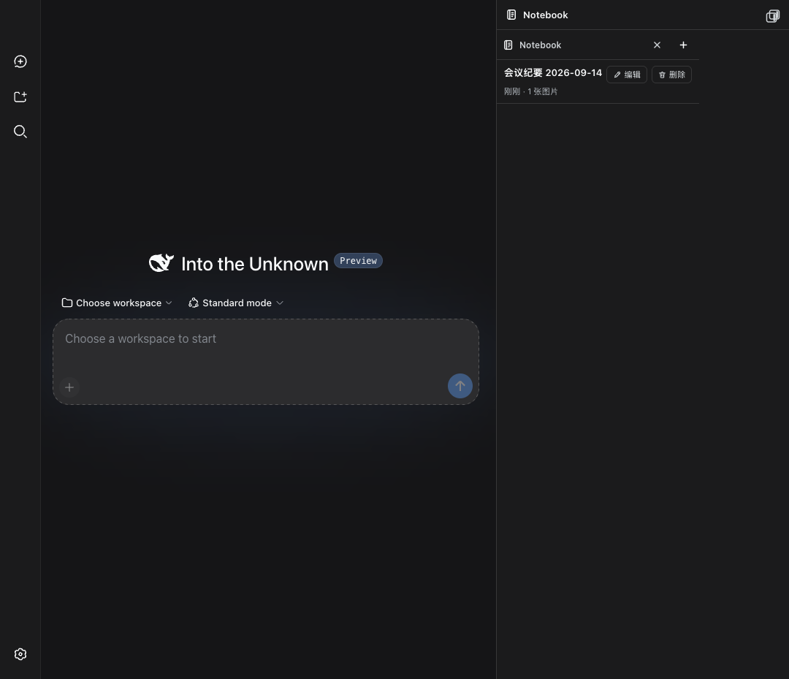
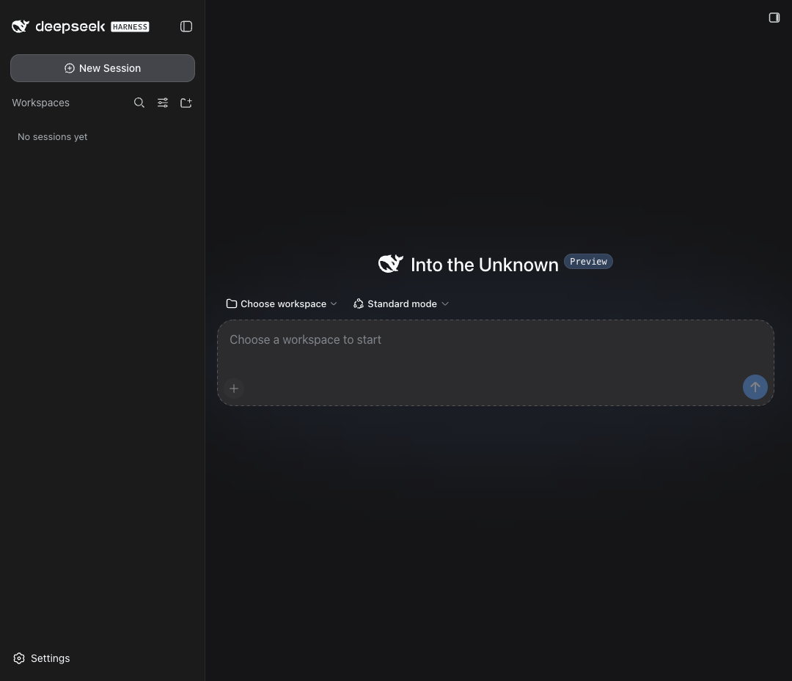

<div align="center">

# dsh-notebook

**A sidebar notebook for DSH** — `+` a new entry → title + body → paste images (videos rejected) → “Done” files it under its title → click the title to copy the body → reference notes with `@` → “Edit” reuses the very same container.

[](https://github.com/wyzh0117/dsh-notebook/actions/workflows/ci.yml)
[](./LICENSE)
[](https://nodejs.org)
[](#compatibility)
[](./test)

`dsh-plugin` · `deepseek-harness` · `notebook` · `notes` · `sidebar`

</div>

> **Suggested GitHub topics:** `dsh-plugin` `deepseek-harness` `notebook` `notes` `sidebar`
>
> 中文文档见 [README.md](./README.md)。

---

## What it is

`dsh-notebook` is a Web plugin for [DSH (DeepSeek Harness)](https://github.com/deepseek-ai/dsh): a small notebook that lives in the sidebar.
No rich-text editor, no cloud sync, no version history — it does one thing: jot down a note that has a title, a body and a few images,
and use it from the composer: a single click on the title copies the body, and typing `@` can reference a note.

Notes are **global** (not isolated per conversation) and images are stored as **real files on the host disk**, addressed by path.

## Features

| Feature | Detail |
|---|---|
| **`+` creates an entry** | The `+` sits in the top-right corner of the sidebar page; clicking it opens the editor container **inside the panel** (no new window, no second sidebar tab) |
| **Text container** | Single-line title `<input>` + body `<textarea>` + image thumbnail strip, sharing one scrollable container |
| **Images yes, videos no** | All three entry points share one validation path: paste (`onPaste`), drag & drop (`onDrop`), and the “Insert image” button (`<input type="file" accept="image/*" multiple>`). `video/*` MIME types and `mp4/mov/webm/mkv/avi/m4v/ogv` extensions are rejected inline with “video files are not supported”; anything that is not an image gets “only image files are supported” |
| **Title + body** | The title is what the list displays; the body carries the content |
| **“Done” files it under its title** | The container closes and the list shows one row per note, titled, newest first, with “time · N images” as secondary metadata |
| **Click the title to copy** | The clipboard receives the **body only** (**never the title**); image markers become a `[image: <name>]` line. A 2-second toast confirms “body copied (N chars)”. **Clicking a title only copies — it never writes into the composer** |
| **`@`-reference a note** | Typing `@` in the composer lists notebook entries next to files and sessions under the localized “Notebook” heading (title + body snippet, a case-insensitive match on title or body, newest first, at most 8 rows). Picking one inserts an **atomic inline chip** like `@session`, whose clipboard/persistence form is the canonical mention `@[title](dsh-notebook:<noteId>)` |
| **The in-row “Reference” button** | Each row gains a “Reference” button next to Edit/Delete that does the same as an `@` pick — insert the same atomic chip (falling back to inserting the body text when the chip path is unavailable); with no reachable composer it toasts “No composer is available in this session” |
| **Auto-open for new sessions (off by default)** | With “Open the notebook for new sessions” on, every session that becomes current (a new one, or a switch to another) opens the Notebook through that tier's own gesture — the native right sidebar and a sidebar product use their `openTab`, the standalone tier expands its own panel; the session already current at plugin activation does not count, so nothing pops up at page load |
| **“Edit” reuses the same container** | The list’s “Edit” button loads that note into the **one and only** `<NotebookEditor>` instance (title, body and thumbnails restored); the DOM never holds more than one editor container |
| **Images land on disk** | Uploaded as `dataURL`, decoded by the host into `$DSH_HOME/storages/notebook-attachments/<noteId>/`; deleting a note deletes its attachment directory too |
| **Atomic writes + serialization** | `notebook.json` is written to a temp file → `fsync` → previous version copied to `.bak` → `rename`; a single in-process mutex serializes every read-modify-write |
| **No silent data loss** | If `$DSH_HOME` is not writable the host degrades to an in-memory store and every API response carries `degraded: true`; the client shows a non-blocking banner |
| **Keyboard** | `Cmd/Ctrl+Enter` = Done, `Esc` = Cancel |

## Three-tier adaptive behaviour (the core design)

DSH’s right column changed owner around 0.1.5-rc.1. Before that, plugins such as `dsh-better-sidebar` drew it themselves;
afterwards DSH owns it and plugins register tabs through `ctx.sidebarRightTabs`. So the client probes once and settles on
one of three tiers — **at most one Notebook entry may exist on the page at any moment**:

| Priority | Tier | Trigger | Registration |
|---|---|---|---|
| 1 | **`native`** | `ctx.get('sidebarRightTabs')` exists (DSH ≥ 0.1.5-rc.1) | Two-phase native registration: `sidebarRightTabs.register({ id, kind, priority:'extension', title, guide })`, then the tab body into the keyed slot `sidebar.right.pane.tab` (same `id` as the key); plus the global `settings.section` seat and the “auto-open for new sessions” watcher |
| 2 | **`service`** | `ctx.get('betterSidebar')` exists (better-sidebar 0.4.0–0.18.x and similar products) | `ctx.betterSidebar.registerTab({ id:'dsh-notebook:notebook', …, single:true, settings:{ pluginToggles, render } })` |
| 3 | **`standalone`** | neither of the above | Draws its own right panel (UI matched to `dsh-better-sidebar` 0.12.1) and registers the **same** global settings seat (`settings.section`) |

Deliberate choices:

- `export const inject = ['slots', 'locale']` — `betterSidebar` is **never** listed in `inject`. A missing service in `inject`
  means the plugin never activates, which would kill tier 3 entirely.
- Detection is “sync first, async fallback”: when both `ctx.get` calls miss, the plugin registers `ctx.inject([...], cb)`
  observers and arms a **700 ms fallback timer**; if no tier has appeared when it fires, standalone is mounted.
- **Late upgrade**: if standalone is already mounted and a service shows up afterwards, standalone is torn down *first*
  and the service registration happens after it — the two are never live at once.
- Every registration sits inside `ctx.effect(() => { …; return dispose })`, so HMR and disable are clean and a second
  activation never throws `already registered`.

### The tier-3 self-drawn panel (matched to better-sidebar 0.12.1)

| Item | Spec |
|---|---|
| Expand button | A 28×28 button pinned to the **viewport’s top-right corner**, 16 px linear panel icon, ~500 ms delayed tooltip, `aria-label` following the expanded state |
| Panel geometry | `PANEL_MIN=280` / `PANEL_MAX=640` / `PANEL_DEFAULT=400`, clamped with `Math.min(max, Math.max(280, round(w)))` |
| Width drag | A 6 px grab strip on the panel’s **left edge**; `setPointerCapture` then track the `clientX` delta |
| Narrow viewport | `innerWidth < 768` collapses to a full-width `100vw` drawer with no drag strip |
| Layout push | Sets `--dsh-notebook-width` plus `data-dsh-notebook-collapsed` / `data-dsh-notebook-dragging`, consumed by one namespaced `<style>` tag that is removed on dispose |
| Collapse | The panel **stays mounted** and slides out (`translateX(100%)`); `visibility: hidden` only after the transition ends |
| Persistence | Open state and width live in `localStorage` (`dsh-notebook:open` / `dsh-notebook:width`, every access wrapped in try/catch) |
| Reduced motion | Honours `@media (prefers-reduced-motion: reduce)` |

## Install

Requirements: Node ≥ 20, DSH ≥ 0.1.1-rc.2, and **pnpm** (this repo does not support npm).

### Option 1 — mount from source (development)

```sh
git clone https://github.com/wyzh0117/dsh-notebook.git
cd dsh-notebook
pnpm install
pnpm build            # emits lib/index.js, lib/client.js, lib/types/**

# mount it into a DSH profile (the web profile here)
dsh plugin --profile web add "link:$PWD"
```

The manual equivalent — in `~/.dsh/profiles/web/package.json`:

```jsonc
{
  "dependencies": { "dsh-notebook": "link:/abs/path/to/dsh-notebook" },
  "dsh": { "profile": { "bundles": [ /* … */, "dsh-notebook" ] } }
}
```

then run `pnpm install` inside the profile directory. `dsh.profile.bundles` must contain `dsh-notebook`,
otherwise the plugin is never loaded.

### Option 2 — install from the repository

```sh
dsh plugin --profile web add github:wyzh0117/dsh-notebook
```

> While developing, **never restart the DSH instance you are working in** (e.g. the Web GUI on port 3080 —
> restarting it kills the current session). For a real end-to-end check, start an isolated environment instead:
> ```sh
> DSH_HOME=/tmp/dshnb-home npx -y --package @deepseek-ai/dsh dsh web --port 3099
> ```

## Usage

1. Expand the right sidebar and open **Notebook**.
2. Click the **`+`** in the top-right corner — the editor container opens inside the panel.
3. Type a **title** and a **body**; add pictures by **pasting or dropping** them, or with “Insert image”.
   - Videos are rejected with “video files are not supported”; a single image is capped at 10 MB and a note at 20 images (adjustable in settings).
4. Click **Done** (or `Cmd/Ctrl+Enter`) — the container closes and the note is filed under its **title**.
5. Click the **title text** — the body (never the title) goes to your clipboard, with a “body copied (N chars)” toast.
   **Clicking a title is a pure copy**: the v1.1 composer attachment bridge exists but has no UI entry point (see the next section).
6. To let the model read a note, type **`@`** in the composer and pick it under the “Notebook” heading, or click **`Reference`** at the
   end of its row — both insert one atomic reference chip, and only the **body** reaches the model (the title is never sent).
7. Use **`Edit`** at the end of the row to load that note into the **same container**; **`Delete`** removes the note and its attachment directory.
8. To see the notebook automatically in every new session, turn on “Open the notebook for new sessions” in settings (off by default; all three tiers honour it).

## DSH session integration (v1.1)

Every seam here is **public** and **entirely optional**: the client bundle can only `require` the module-table entries, never import
a DSH UI package, so every member is duck-typed and every call is guarded — a host without `ctx.conversation` /
`ctx.inputTriggers` / `ctx.sessions` merely loses one capability and falls back to the v1 behaviour, never to an error.

Two capabilities are user-visible: `@` references (§2) and “auto-open for new sessions” (§3). A third, the composer attachment
bridge (§1), is **implemented, unit-tested and deliberately unwired** — no UI calls it.

### 1. The composer attachment bridge (**implemented, unwired**)

> **Product decision (2026-09-15):** clicking a title must **only copy**, never write into the composer on its own. Its only entry
> point was therefore removed: the title action in `NotebookView` is `handleCopyBody` (a plain `buildClipboardText` + `copyText`) and
> no longer calls `attachImages`; `composer.ts` carries the same WIRING NOTE on `NotebookComposer`.
> The code and its tests are **kept on purpose** — the seams are the expensive part and they are already covered — waiting for an
> explicit action of their own.

What the bridge does (for a future caller, and why it is worth keeping):

- `attachImages(note)`: resolve the target (a current session from `ctx.sessions`, the `ctx.conversation` service and that session's
  input facade) → re-read the stored bytes over the plugin's own `GET /notebook/api/attachments/<noteId>/<file>` route into `File`s →
  `ctx.conversation.createDrafts(sessionId, files)` to mint browser-owned draft attachments → `input.addAttachments(ids)` for the rail.
  The images live in the draft only and **upload when the prompt is sent**; a rail **refusal** releases the drafts through
  `releaseDraftAttachments` (no object URL or upload outlives the attempt). Formats the composer cannot take (**not SVG** — only
  png / jpeg / webp / gif) count as `skipped`, unreadable files as `failed`, and a batch that inserts nothing reports
  `no-target` / `no-images` / `fetch-failed`.
- `appendText(text)`: writes `buildBodyText(note)` (every image marker **removed**, so the rail is not duplicated) into the draft,
  preferring the session-scoped `slash/input-insert-text` (spliced at a caret span, so `@`-chips already in the draft keep their
  identity), then the facade's own `insertText`, and only as a last resort a whole-draft `setDraft` rebuild.
- The path has **no UI entry point**: the `attached` / `attachedPartial` / `attachSkipped` / `attachReadFailed` /
  `attachedBodySkipped` toasts were removed from `locales.ts` together with it (the last leftover key, `attachFailed`, has since been removed too, so the final artifact carries no attachment toast at all; no code
  references).
- Because the title action is a pure copy, **this bridge does not affect `@` references**, which ride a different seam (below).

### 2. The `@` source and the “Reference” button

- The plugin registers a `@` source named `dsh-notebook` through `ctx.inputTriggers.registerSource` (`order: 20`; the built-in source
  sits at 0), so typing `@` lists notebook entries next to files and sessions. Each row shows the title plus a body snippet
  (markers dropped, whitespace collapsed, truncated at 60 characters) under the localized “Notebook” heading. Candidates are filtered
  **case-insensitively** on title and body, **newest update first, at most 8 rows**; an aborted query or a failed read yields no rows
  (it never breaks the menu that also lists files and sessions). A refused registration (an HMR predecessor that has not
  unloaded yet, and the source name is the serialization routing key so it cannot be renamed) is retried every 500 ms, up to
  five times, before the plugin gives up with a warning.
- Picking a row inserts an **atomic inline chip** (labelled with the title) whose clipboard/persistence form is the canonical mention
  `@[title](dsh-notebook:<noteId>)` (brackets are stripped out of the label).
- At **send time** the trigger pipeline asks the source's codec to serialize each chip occurrence: the plugin returns the note's
  **body only** — **the title is deliberately never sent** — with each image marker rendered as one `[image: <name>]` line.
- The failure policy mirrors the pipeline's own contract: a **deleted note** serializes to nothing (the reference is simply gone and the
  send proceeds), while a **real read failure** rejects — the send is blocked with a visible error instead of silently downgrading the
  mention to `@title`.
- The in-row **“Reference”** button takes the same road: it inserts the same chip through the session-scoped
  `slash/input-insert-reference` event (spliced at a caret span, so the chip stays a chip), and falls back to inserting the note's body
  text when that path is unavailable. With no reachable composer it toasts `refUnavailable` (“No composer is available in this session”)
  rather than pretending it worked.
- The three row actions (Reference / Edit / Delete) now **wrap** (`flexWrap`), so a title and its buttons stay readable in the narrowest panel.

### 3. Auto-open for new sessions (off by default)

| Item | Behaviour |
|---|---|
| Preference | `autoOpenOnNewSession`, **default `false`**, persisted with every other preference in the host's `NotebookDoc.prefs` |
| Tier | **All three tiers wire it** (`attachSessionAutoOpen`), each with its own gesture; where a carrier cannot open anything (a sidebar product without `openTab`) the watcher simply stays inert rather than pretending |
| Trigger | The current session in the session list **becomes a different one** (a new session, or a switch) — a re-published snapshot of the same session does not count |
| Never fires | For the session that is **already** current when the plugin activates (no popup at page load), nor when `current` becomes `null` (the hero screen) |
| Retry | `openTab` throws (or `open()` reports failure) while the new session's sidebar surface is still mounting, so the open is retried at `0 / 200 / 500 / 1200 / 2500 ms` and abandoned the moment the session changes again or the plugin unloads |
| Gesture | Tier 1: `sidebarRight.openTab('dsh-notebook')` plus `toggleExpanded()` while collapsed; tier 2: `service.openTab({ type, title })`; tier 3: the self-drawn panel's `control.setOpen(true)` |
| Settings seat | Tiers 1 and 3 register the **same** global settings section (`settings.section`, shared through `hosts/settingsSeat.ts`, carrying all six preferences); tier 2 goes through `registerTab({ settings })`, whose inventory is five rows (every preference except `openOnStart`) while the panel it renders is the same one |

## Architecture

```
                     ┌─────────────────────────── browser ───────────────────────────┐
                     │ lib/client.js  (CJS module-table factory, id = "dsh-notebook")│
                     │  three-tier detect → native / service / standalone            │
                     │  NotebookView ─ NotebookEditor(one instance) ─ clipboard      │
                     │  composer bridge (ref chip; attach/body code unwired)         │
                     └──────────────────────────────┬────────────────────────────────┘
                                     fetch JSON      │
                     ┌──────────────────────────────┴────────────────────────────────┐
                     │ lib/index.js   (cordis plugin, ctx.webServer prefix)           │
                     │  routes.ts ─ store.ts (atomic write + mutex) ─ attachments.ts  │
                     └──────────────────────────────┬────────────────────────────────┘
                                                    │
                            $DSH_HOME/storages/notebook.json
                            $DSH_HOME/storages/notebook.json.bak
                            $DSH_HOME/storages/notebook-attachments/<noteId>/<attachmentId>.<ext>
```

In the native tier the tab body reads visibility from the slot's injected `useTabInfo()` hook (DSH 0.1.5-rc.2 renders a tab
without a plain `props.tab.visible`), so a **hidden tab really does skip loading and polling** — `NotebookView` issues no host
request at all while `visible === false`.

### Host HTTP API

Registered on `ctx.webServer` (`kind: 'prefix'`, `path: '/notebook/api'`), JSON over HTTP,
with `Cache-Control: no-store` on **every** response.

| Method | Path | Request | Response |
|---|---|---|---|
| `GET` | `/notebook/api/state` | — | `{ doc, degraded? }` |
| `POST` | `/notebook/api/notes` | `{ title, body, attachments: [{ name, mime, size, dataUrl }] }` | `{ note }` |
| `PATCH` | `/notebook/api/notes/:id` | `{ title?, body?, attachments? }` | `{ note }` |
| `DELETE` | `/notebook/api/notes/:id` | — | `{ ok: true }` |
| `PATCH` | `/notebook/api/prefs` | `Partial<NotebookPrefs>` | `{ prefs }` |
| `GET` | `/notebook/api/attachments/:noteId/:file` | — | image bytes + `Content-Type` |
| `GET` | `/notebook/api/health` | — | `{ ok, version, degraded }` |

- Images are uploaded as **dataURL** (client-side `FileReader`) and decoded by the host — no multipart parser dependency.
- **Security fence**: only loopback requests are accepted (`req.socket.remoteAddress ∈ 127.0.0.1/::1`) and
  `Origin`/`Host` must be an allowed local origin, otherwise `403`; path parameters are traversal-checked
  (`path.resolve` must stay inside the attachments root). Request bodies are capped at 32 MB (`413` beyond that).
- `400/403/404/413/415/500` all return a structured `{ error: { code, message } }`.
- **The host re-checks for video** (it does not trust the client) and answers `415`.

### On-disk layout

| Path | Contents |
|---|---|
| `$DSH_HOME/storages/notebook.json` | `NotebookDoc` (`version: 1`, `notes[]`, `prefs`), written atomically |
| `$DSH_HOME/storages/notebook.json.bak` | The last known-good version; used first when the JSON is corrupt |
| `$DSH_HOME/storages/notebook-attachments/<noteId>/<attachmentId>.<ext>` | Image bytes |

`$DSH_HOME` resolution order: explicit injection > `process.env.DSH_HOME` (whitespace-only counts as unset) > `~/.dsh`.
If `.bak` is corrupt too the store starts from an empty document and renames the broken file to `notebook.json.corrupt-<ts>`.

## Settings

All three tiers share **one definition**, whose source of truth is the host’s `NotebookDoc.prefs`
(consistent across tiers and browsers). Reads and writes always go through `PATCH /notebook/api/prefs` —
tier 2 deliberately does **not** use better-sidebar’s own `pluginSettings`, which would let the tiers drift apart.

| Key | Type | Default | Meaning |
|---|---|---|---|
| `sortOrder` | `'updated' \| 'created' \| 'title'` | `'updated'` | List ordering: recently updated / recently created / title ascending |
| `copyImagesAsName` | boolean | `true` | When copying, render images as a `[image: <name>]` line |
| `maxImagesPerNote` | number | `20` | Image cap per note (1–100) |
| `confirmDelete` | boolean | `true` | Ask before deleting |
| `openOnStart` | boolean | `false` | **tier 3 only**: expand the sidebar on DSH startup |
| `autoOpenOnNewSession` | boolean | `false` | Open the Notebook page whenever a session becomes current (all three tiers honour it; off by default, nothing pops up at page load) |

Where they surface: tiers 1 and 3 register the **same** global settings section (`settings.section`, shared through
`hosts/settingsSeat.ts`), so both tiers expose identical fields and copy; tier 2 goes through
`registerTab({ settings: { pluginToggles, render } })` — its declarative inventory is now five rows (every preference except
`openOnStart`, which only means something in the standalone tier) while the panel it renders is the same one.
Every edit travels through `PATCH /notebook/api/prefs` into `NotebookDoc.prefs` (the host validates every key).

## Relationship to dsh-better-sidebar

- **This is not a fork of it, and it does not depend on it.** `dsh-better-sidebar` appears only in `peerDependencies`
  with `optional: true`, and the source contains **zero imports** of it (it duck-types `ctx.betterSidebar` instead),
  so two instances of it can never be pulled in.
- **With it installed (0.4.0–0.18.x)**: tier 2. Expanding its right sidebar shows Notebook **in addition to** its own
  editor / git / terminal / browser tabs. We deliberately avoid its reserved ids
  (`editor` `git` `subagent` `sidechat` `terminal` `browser` `diff`); ours is `dsh-notebook:notebook`.
- **With it at 0.19+ (the right column now belongs to DSH)**: tier 1 — the tab shows up in the column DSH itself draws.
- **With no sidebar product at all**: tier 3 — the plugin draws its own expandable right panel, matched to
  better-sidebar 0.12.1 (button placement, panel width and dragging, full-width narrow mode, collapse animation).

## Compatibility

| | |
|---|---|
| DSH | Minimum supported `>=0.1.1-rc.2`; **the development machine runs `0.1.5-rc.2`** with `@deepseek-ai/dsh-client-ui-sidebar-right` installed, so the native right sidebar exists and **tier 1 is the live tier here** (tier 1 needs DSH ≥ `0.1.5-rc.1` plus that package) |
| Node | `>=20` (development and build) |
| `dsh-better-sidebar` | Optional. Tier 2 targets 0.4.0–0.18.x; 0.19+ is handled by tier 1 |
| Optional DSH plugins | When `conversation` (the session composer), `inputTriggers` (the `@` pipeline) or `sessions` (the session list) is missing, the matching integration simply turns off and the v1 behaviour returns |

## Known limitations (deliberately out of scope for v1 / v1.1)

- **No video / audio or other rich media** — an explicit requirement. Both the client and the host reject it.
- No multi-user, cloud sync, sharing, live collaboration or AI auto-organising.
- **No version history**: only the most recent content is kept.
- Notes are **global**, not isolated per conversation.
- The body is **plain text plus Markdown image markers** (``), not rich text;
  no rich-text editor dependency is pulled in.
- Tier-1's registration sequence is covered by `test/tier-detect.test.ts` with a fake ctx and was checked against the
  0.1.5-rc.2 **real type declarations** (see the header of `src/client/hosts/native.ts`); this machine has
  `dsh-client-ui-sidebar-right` and tier 1 is the live tier, but the three v1.1 behaviours have **not been clicked through a
  GUI** (unit / component tests plus the live endpoint checks in “Verification status”).
- **SVG cannot ride the composer attachment bridge**: the bridge accepts png/jpeg/webp/gif only (notes themselves still support
  SVG; this bridge simply will not take it). The bridge currently has no UI entry point — see “DSH session integration”.
- **A reference sends the body, never the title**: the title in `@[title](…)` is a human-facing label and is deliberately
  dropped at serialization time; images become one `[image: <name>]` line.
- **An unsent `@` reference degrades to a literal mention after a page reload**: DSH persists an unsent draft as its
  **clipboard projection** in `localStorage` (`dsh.conversation`, per session), and the plugin has no host-side mention
  resolver — `dsh-session:` mentions are expanded by `@deepseek-ai/dsh-session-reference` at `agent/pre-step`, a seam this
  plugin does not hook — so after a reload the model receives the literal text `@[title](dsh-notebook:<noteId>)` instead of
  the note body. Workaround: send before reloading, or re-insert the reference. A host-half expander on the same
  `agent/pre-step` seam is the identified fix and is deliberately left out of v1.1.
- **“Open the notebook for new sessions” is inert on a carrier that cannot open anything**: all three tiers wire the same
  watcher, but a sidebar product without `openTab` never opens anything (and never pretends it did).
- The session-integration capabilities **depend on the host**: without the conversation / input-trigger / sessions services
  the plugin falls back to the v1 behaviour (clipboard copy, no Reference button).
- DSH source is never modified (hard constraint).

## Development

```sh
pnpm install        # pnpm only; npm is unsupported in this repo
pnpm typecheck      # tsc --noEmit
pnpm test           # vitest run (node env for the host half, jsdom for *.test.tsx)
pnpm build          # tsc -p tsconfig.build.json && tsdown → lib/index.js + lib/client.js + lib/types/**
pnpm watch          # tsdown --watch
```

The repo root carries a `pnpm-workspace.yaml` whose single setting is `autoInstallPeers: false`. Why: `dsh-better-sidebar` is an *optional* peer,
pnpm tries to resolve it anyway, picks 0.19.x, and then cannot satisfy that package’s `@deepseek-ai/*` peer ranges
(`^0.1.5`) — npm only publishes those as prereleases (`0.1.5-rc.2`), and semver never matches a prerelease against a
non-prerelease range, so the install dies with `ERR_PNPM_NO_MATCHING_VERSION`. Every peer this repo builds against is
an explicit `devDependencies` entry, so disabling peer auto-install costs nothing. See
[`docs/specs/scaffold-notes.md`](docs/specs/scaffold-notes.md).

The client artifact is **not** plain ESM — it is a CJS closure factory registered with the global module loader:

```js
window.__ModuleLoader__.load({ id: "dsh-notebook", factory: (require) => {
  var module = { exports: {} }; var exports = module.exports;
  /* …bundled CJS code… */
  exports.apply = apply; exports.inject = inject;
  return module.exports;
} });
```

Therefore `src/client/**` may **not** import `node:*`, and may **not** import any `@deepseek-ai/*` package as a
**value** except the module-table entries (`react`, `react/jsx-runtime`, `react-dom`, `react-dom/client`,
`@deepseek-ai/dsh-client-ui-slots`, `@deepseek-ai/dsh-client-ui-primitives`). `codeSplitting: false` is required too —
the factory’s `require` cannot resolve relative chunk URLs.

## Screenshots

> Real screenshots from a live run (DSH `0.1.1-rc.2` at the time, no sidebar product installed — tier 3, the self-drawn panel):

| | |
|---|---|
|  |  |
| The Notebook list in the sidebar (`+` in the top-right); expanding pushes the conversation column 400px | The editor container: title, body and image thumbnails (paste / drop / picker) |
|  |  |
| The “body copied” toast after clicking a title — the body only, never the title | The self-drawn panel (tier 3): the toggle is pinned to the viewport's top-right corner |

## Verification status

Checked live in an **isolated environment** (`DSH_HOME=/tmp/dshnb-home`, never against the instance in use); the tier 3 / tier 2
rows are records from the `0.1.1-rc.2` era, while the last two rows are the **currently running 3080 instance** (DSH `0.1.5-rc.2`):

| Item | How | Result |
|---|---|---|
| `tsc --noEmit` | whole repo | 0 errors |
| Unit / component tests | `vitest run` | **164 passed (12 files)** |
| Build | `tsc -p tsconfig.build.json && tsdown` | `lib/index.js` (ESM 54 KB / 54410 B) + `lib/client.js` (CJS 148 KB / 148508 B) + `lib/client.js.map` |
| Client bundle shape | CI executes `lib/client.js` against a stub `require` | `id=dsh-notebook`, `exports=apply,inject,…`, `inject===['slots','locale']`, zero `node:` requires |
| **Tier 3** (no sidebar product) | real browser | toggle pinned to the viewport's top-right corner (`top:10,right:innerWidth-10`, 28×28); expanding sets `--dsh-notebook-width: 400px` and pushes `#root` by 400px; 6 px drag strip on the left edge; collapse animates `translateX(102%)` + `visibility:hidden` with the push back to zero |
| **Tier 3, G3–G8** | real browser, item by item | `+` → exactly **one** editor container; title and body written; pasted png accepted, pasted mp4 rejected with “video files are not supported”; “Done” closes it and files the note under its title; clicking the title put the **body (no title)** on the clipboard with images as `[image: nb-test-image.png]` and a “body copied (67 chars)” toast; “Edit” reopened the **same** container with title, body and thumbnails restored |
| **Tier 2** (`dsh-better-sidebar@0.12.1`) | real browser | the self-drawn panel is **not** mounted (detection settles on the service tier); better-sidebar's “New tab” shows **Notebook** next to Explorer / Source Control / Tasks / Terminal / Browser, rendering this plugin inside its own panel against the same global notes |
| Persistence | restart + reinstall through another channel | `notebook.json`, `.bak` and `notebook-attachments/<noteId>/<image>.png` land correctly; data survives a release-tarball install and the attachment route answers `200 image/png` |
| Release artifact | release tarball into a clean profile | `dsh plugin` mounts it, host routes and client bundle both work |
| CI | GitHub Actions | green |
| **v1.1 artifact is served** (running 3080 instance) | `GET /plugins/??dsh-notebook/client.js&rev=<framed hash>` | **200**; the served bytes carry `slash/input-insert-reference`, `slash/input-insert-text`, `autoOpenOnNewSession`, `noteReferenceInsert`, `useTabInfo` (plus the `createDrafts` / `attachImages` symbols of the retained-but-unwired bridge) — i.e. the v1.1 code really is in the artifact being served, while the retired attachment toasts (`attachSkipped` / `attachReadFailed`) **no longer appear**. rev = first 12 hex of `sha1("plugin-artifact" ‖ \0 ‖ len:lib/client.js ‖ len:lib/client.js.map)`; it **changes on every rebuild**, so recompute it from the current `lib/` (`f2b51cf68d61` for the build this document was written against) |
| **v1.1 host routes are online** | `GET /notebook/api/state`, `GET /notebook/api/attachments/<noteId>/<file>` | `state` → **200** `application/json` with the real document; attachment → **200 `image/png` (663081 bytes)** — the byte-fetch path the attachment bridge performs per image (the bridge is implemented but unwired, so no UI calls it) |

Tier 1 (the native right sidebar of DSH ≥ 0.1.5-rc.1) has **not been clicked through a GUI**: its registration sequence is
covered by `test/tier-detect.test.ts` with a fake ctx and was checked against the 0.1.5-rc.2 **real type declarations** (the
header of `src/client/hosts/native.ts` records this); this machine has `dsh-client-ui-sidebar-right` installed and tier 1 is
the live tier.

The user-visible v1.1 capabilities (`@` reference + “Reference”, auto-open for new sessions) have **not been clicked through a
GUI**; their behaviour rests on unit / component tests. The composer attachment bridge has no UI entry point and is covered at
bridge level only (what the live instance did verify is the last two rows above: the artifact is served and the host routes
answer):

| Feature | Tests covering it | What they assert |
|---|---|---|
| Composer attachment bridge (**implemented, unwired, no UI entry point**) | `test/composer.test.ts` (31); `test/view-actions.test.tsx` (7) asserts the **opposite** | Bridge level: target resolution (null without the conversation service, a current session or a scope), stored images re-read into `File`s, the `createDrafts` + `addAttachments` call sequence, drafts released on refusal, SVG skipped, the image cap honoured, the three text-write paths (scoped event → `insertText` → `setDraft`), the exact detect-span math (including a chip with empty clipboard text), and no invented success without a target or insertable images. UI level: **clicking a title copies and leaves the composer completely alone** (an image note too), with the same copy when no bridge exists |
| `@` reference + “Reference” | `test/reference.test.ts` (17) + `test/view-actions.test.tsx` (7) | `registerSource` registers exactly once and disposes, a refused registration retried within the budget and reported once it is exhausted, candidate filtering / ordering / the 8-row cap / the section, `onPick`'s chip and canonical mention, **serialization carrying the body and never the title**, a deleted note serializing to nothing, a real read failure propagating, and the row button inserting a reference or reporting `refUnavailable` |
| Auto-open for new sessions | `test/auto-open.test.ts` (11) + `test/tier-detect.test.ts` (14) + `test/native-tab-body.test.tsx` (3) | nothing for the session already current at activation, once per change (not per snapshot), nothing while the preference keeps its `false` default, retries at `0 / 200 / 500 / 1200 / 2500 ms` while the surface is unmounted and abandonment when the session changes again, silence without `ctx.sessions`, **each tier wiring its own open gesture** (native `openTab` / sidebar `openTab` / the self-drawn panel's `setOpen`), the native tab body reading visibility from the injected `useTabInfo()` hook (hidden really means no load and no polling), and `mergePrefs` applying only present keys |

One drift guard is worth naming: `test/routes.test.ts`'s “accepts EVERY preference key the plugin exposes” asserts that the
key set accepted by `PATCH /notebook/api/prefs` equals `Object.keys(DEFAULT_PREFS)` — it is what caught the real bug where
`/prefs` silently dropped `autoOpenOnNewSession`.

The DSH seams these features rely on (`ctx.sessions`, `ctx.conversation.createDrafts` / `input.for(actx)`, the
session-scoped `slash/input-insert-reference` / `slash/input-insert-text`, `ctx.inputTriggers.registerSource`) were read
from **DSH `0.1.5-rc.2`'s published client packages** (type declarations and implementation), not confirmed by clicking
through a live GUI: this machine also runs `0.1.5-rc.2` with `dsh-client-ui-conversation` /
`dsh-client-ui-input-trigger` / `dsh-client-ui-sidebar-right` all present, and the three features above are still guaranteed
by unit / component tests alone (the live checks covered the served artifact and the host endpoints, nothing more).

## FAQ

**I dropped an mp4 — nothing happened.**
v1 does not support video. Both the client and the host reject it and show “video files are not supported”.

**Why does the copied body contain `[image: name]` instead of the picture?**
The clipboard gets plain text; images are files on disk and cannot travel as text, so they become a filename line.
Turn `copyImagesAsName` off in settings to drop the markers entirely instead.

**Does clicking a title send the note's images into the composer?**
No. v1.1 briefly wired image notes into the composer (images attached, body in the draft), but the product decision of
2026-09-15 turned the title click back into a **pure copy**, which removed its only entry point. The bridge code and its unit
tests are kept in `composer.ts` (waiting for an explicit action of its own), but **no UI can trigger it today**: clicking a title
always just copies the body to the clipboard.

**Why did my `@` reference turn into `@[title](dsh-notebook:xxx)` after a reload?**
DSH persists an unsent draft as its clipboard projection in `localStorage`, and this plugin has no host-side mention resolver
(`dsh-session:` mentions are expanded by `@deepseek-ai/dsh-session-reference` at `agent/pre-step`, a seam the plugin does not
hook), so the chip degrades to literal text. Send before reloading, or re-insert the reference.

**What does an `@` reference actually send?**
The body only. The chip shows the title, but serialization sends the body (each image marker becoming one `[image: <name>]` line);
the title is a human-facing label and is **never** handed to the model. A note that has been deleted contributes nothing, and a
real read failure blocks the send with a visible error.

**Where are my notes stored? Is anything uploaded?**
Entirely on your machine under `$DSH_HOME/storages/`. Nothing is uploaded anywhere, and the HTTP API only listens on loopback.

**Can images get lost?**
Not silently. A failed upload keeps the entry as an error item you can retry; if `$DSH_HOME` is not writable the
store degrades to memory and every API response carries `degraded: true`, which the UI surfaces as a banner.

**Can I run this alongside better-sidebar?**
Yes — that is exactly tier 2. Notebook shows up as one entry inside its right sidebar.

**Will tier 1 work on my machine?**
If your DSH is older than 0.1.5-rc.1 there is no `ctx.sidebarRightTabs`, so the plugin falls back to tier 2 or tier 3.

**`pnpm install` fails with `ERR_PNPM_NO_MATCHING_VERSION: @deepseek-ai/dsh-*`?**
That is pnpm auto-installing peers. This repo’s root `pnpm-workspace.yaml` sets `autoInstallPeers: false`
(pnpm 11 reads project settings from `pnpm-workspace.yaml`); add the same setting
if you replicate the package config elsewhere.

## License

[MIT](./LICENSE) © 2026 wyzh0117
